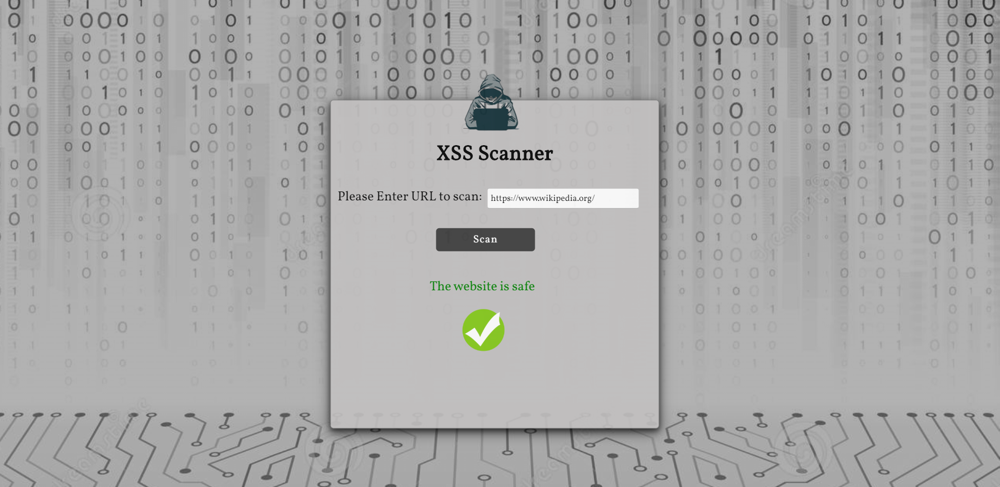

### Technologies
 * Puppeteer
 * Javascript
 * NodeJS
 * Express
 
 
 
### How to install

Clone the repository:
```
git clone https://github.com/MariaGarber/XSS-Scanner.git
```
Enter the clonned folder:
```
cd XSS-Scanner
```
Install the dependencies:
```
npm install
```
Run the application:
```
npm start
```
Abre en Chorome : http://localhost:4000/
